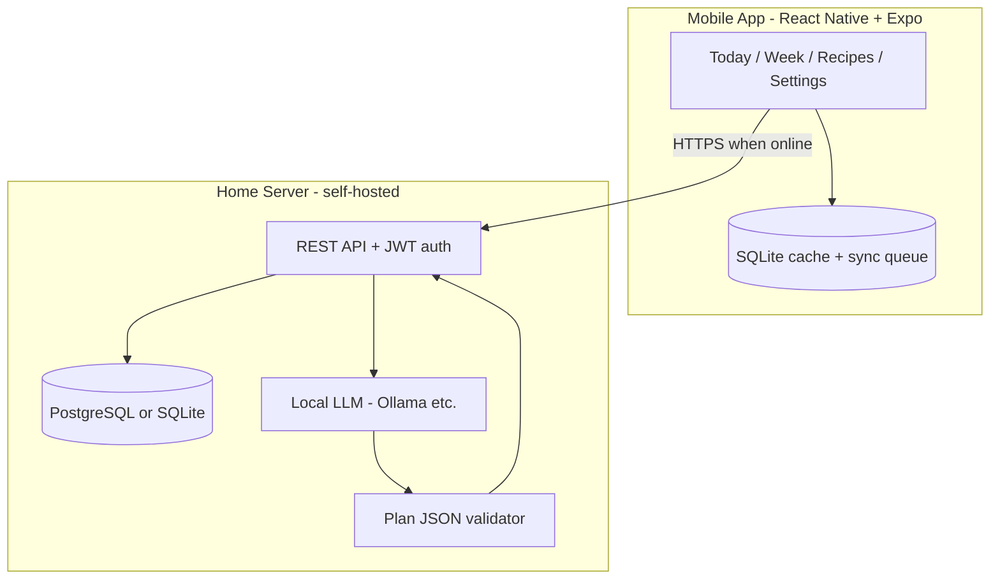

# Meal Planner App — Master Plan (Agent Handoff)

> **Purpose:** Self-contained plan for building a personal meal-planning app.  
> **Repo:** `assistantApp`  
> **Status:** M1 finalized (rev. 2). M2–M6 outlined, not yet detailed.  
> **Last updated:** 2026-06-09

Use this document as the single source of truth when continuing work in a new agent session. Detailed M1 spec also lives in [`meal-planner-spec.md`](./meal-planner-spec.md).

---

## 1. Project summary

A **mobile-first meal planner** for a single user doing a **clean bulk** at the gym. The app proposes meal plans; the user reviews, swaps, and approves. It connects to a **self-hosted home server** that calls a **local LLM** for plan generation, with a **rule-based code fallback** when offline.

### User pain points (original)

| # | Pain point | Target milestone |
|---|------------|------------------|
| 1 | Hit the right macros for clean bulk | M1 |
| 2 | Vitamins, micronutrients, supplements | M4 |
| 3 | Kitchen inventory + replenish fresh produce every 3 days | M2 |
| 4 | Auto-send meal prep instructions to maid via WhatsApp | M3 |

### Core loop

```
Goals & profile → Meal plan → (M2: inventory check) → (M2: shop every 3 days)
       ↑                                    ↓
  Log deviations (M5)              (M3: WhatsApp to maid)
```

---

## 2. Milestone roadmap

| ID | Name | Status | Scope |
|----|------|--------|-------|
| **M1** | Planner MVP | **Finalized** | Profile, macros, recipes, AI+code plan gen, auth, backend, offline |
| **M2** | Inventory + 3-day lists | **Finalized** | Pantry, end-of-day deduct, shopping list, bulk-order alert (≥4 items) |
| **M3** | Maid handoff | Not started | WhatsApp message builder / send |
| **M4** | Micros + supplements | Not started | Nutrient rollup, gap alerts, supplement schedule |
| **M5** | Smart rebalance | Not started | Eating-out log, dynamic replan, training-day splits |
| **M6** | Automation | Not started | Cron, WhatsApp Business API, push notifications |

**Documentation rule:** When a milestone is finalized, add a full section to `meal-planner-spec.md`. Do not rewrite prior milestones.

---

## 3. Architecture (finalized)

### 3.1 Components



### 3.2 Key decisions

| Area | Decision |
|------|----------|
| Mobile | React Native + Expo, TypeScript |
| Client DB | SQLite (`expo-sqlite`) + Zustand |
| Backend | Self-hosted at home, exposed via HTTPS (Tailscale / reverse proxy) |
| Server DB | PostgreSQL (or SQLite for solo home use) |
| Auth | JWT access + refresh tokens (email + password) |
| Source of truth | Server when online; device SQLite = cache + outbound sync queue |
| Plan generation | **Primary:** home server → local LLM. **Fallback:** rule-based code on device |
| Units | **Metric only** — grams (g), millilitres (ml), cm, kg |
| Design | Pencil (`.pen` files in `design/`) — see T-DESIGN-1 |

### 3.3 Offline behaviour

| Capability | Online | Offline |
|------------|--------|---------|
| View today's approved plan | ✓ | ✓ |
| View / edit recipes | ✓ (sync on reconnect) | ✓ (queued writes) |
| Generate plan (AI) | ✓ via home LLM | ✗ — use code fallback |
| Approve day, swap, skip | ✓ | ✓ (queued sync) |
| Login | ✓ | Cached session until expiry |

**Sync:** last-write-wins per entity using `updated_at`; `sync_queue` on device for pending mutations.

### 3.4 Plan generation flow

1. App sends profile, macro targets, recipe catalog, constraints → `POST /api/v1/plans/generate`
2. Server builds prompt → calls **local LLM** → expects structured JSON
3. **Code validates:** schema, slot types, allergies, macro bounds (±15% calories, ±10g protein)
4. Invalid → retry once → fallback to **rule-based planner**
5. Save as `draft`; user approves per day

**Code fallback algorithm (per day, per slot):**

1. Filter active recipes by slot type, dietary tags, allergies
2. Score vs remaining daily macros — **protein distance first**, then L1 on cal/P/C/F
3. Penalize same recipe as previous day same slot
4. Pick best; subtract macros from remaining

---

## 4. Data models (M1)

### 4.1 Entity relationships

```
User 1──1 UserProfile
User 1──* Recipe
Recipe 1──* RecipeIngredient ──► FoodItem
User 1──* MealPlan 1──* MealPlanSlot ──► Recipe (nullable if skipped)
```

### 4.2 UserProfile

| Field | Type | Default / notes |
|-------|------|-----------------|
| `email` | string | Auth |
| `sex` | male \| female | BMR formula |
| `age` | int | Years |
| `height_cm` | number | Metric |
| `weight_kg` | number | Metric |
| `activity_level` | sedentary \| light \| moderate \| active \| very_active | |
| `goal` | `clean_bulk` | Only goal in M1 |
| `protein_g` | number | **BE stored.** User-confirmed at onboarding; editable in Settings. |
| `carbs_g` | number | **BE stored.** User-confirmed at onboarding; editable in Settings. |
| `fat_g` | number | **BE stored.** User-confirmed at onboarding; editable in Settings. |
| `target_kcal` | number | **BE stored.** FE computes `(P×4)+(C×4)+(F×9)` and sends alongside PCF. Read by Today and Week screens. |
| `meals_per_day` | int | 4 |
| `meal_times` | time[] | breakfast, lunch, snack, dinner |
| `dietary_tags` | string[] | e.g. vegetarian |
| `allergies` | string[] | Hard exclude in planner |

> **FE-only, never sent to BE:** `surplus_kcal`, `protein_g_per_kg`, `fat_pct_of_calories`. Transient onboarding inputs used to seed the PCF suggestion. Discarded once the user confirms on Step 3.

### 4.3 Macro engine

**PCF is the source of truth. Calories are always derived from P, C, F — never the base.**

#### Step 1 — Onboarding suggestion (FE only, no server call)

1. **BMR** — Mifflin–St Jeor (kg, cm) — computed on device
2. **TDEE** = BMR × activity multiplier (1.2 … 1.9) — computed on device
3. **Suggested kcal** = TDEE + surplus_kcal *(range −400 to +400; negative = deficit)*
4. **Protein g** = protein_g_per_kg × weight_kg
5. **Fat g** = (suggested_kcal × fat_pct) / 9
6. **Carbs g** = (suggested_kcal − 4×protein − 9×fat) / 4

Results shown on Onboarding Step 3 as editable suggestions. `surplus_kcal`, `protein_g_per_kg`, `fat_pct_of_calories` are **discarded after this step** — never sent to the server.

#### Step 2 — User confirms → FE computes → POST to server

7. User reviews and optionally edits `protein_g`, `carbs_g`, `fat_g` on Step 3
8. **FE computes** `target_kcal = (P×4) + (C×4) + (F×9)`
9. App POSTs `{ protein_g, carbs_g, fat_g, target_kcal, ...biometrics }` — server stores as-is, runs no macro logic

> When the user edits macros in Settings, the FE recomputes `target_kcal` and PATCHes `{ protein_g, carbs_g, fat_g, target_kcal }` to the server.

Warn in UI if carbs < 100g.

### 4.4 FoodItem

| Field | Type | Notes |
|-------|------|-------|
| `name` | string | |
| `unit_type` | solid \| liquid | solid → per 100g; liquid → per 100ml |
| `calories`, `protein_g`, `carbs_g`, `fat_g` | number | Per 100g or 100ml |
| `category` | enum | protein, carb, fat, vegetable, fruit, dairy, oil, spice, other |
| `is_oil` | bool | true for cooking oils |
| `source` | seed \| user | |

Seed ~40–60 Indian + gym staples including oils (sunflower, ghee, olive, etc.).

### 4.5 Recipe

| Field | Type | Notes |
|-------|------|-------|
| `name` | string | |
| `slot_types` | enum[] | breakfast, lunch, snack, dinner |
| `servings` | number | Default **1** = one eating occasion |
| `prep_time_min`, `cook_time_min` | int | Optional |
| `tags` | string[] | vegetarian, meal_prep, quick |
| `instructions` | string[] | Ordered steps |
| `notes` | string | Private; maid use in M3 |
| `is_active` | bool | |
| **Computed** | | `calories`, `protein_g`, `carbs_g`, `fat_g` per serving |

### 4.6 RecipeIngredient

| Field | Type | Notes |
|-------|------|-------|
| `food_id` | uuid | → FoodItem |
| `amount_g` | number | For solid foods only |
| `amount_ml` | number | For liquid foods only |
| `preparation` | string | e.g. "finely chopped" |
| `sort_order` | int | |

Exactly one of `amount_g` or `amount_ml`, matching food `unit_type`.

**Example — Paneer bhurji (1 serving):**

| Ingredients | Amount |
|-------------|--------|
| Paneer | 150 g |
| Onion | 50 g |
| Tomato | 80 g |
| Green chili | 5 g |
| Spices | 3 g |
| Sunflower oil | 10 ml |

> Oils are treated as regular ingredients — no separate section in UI or data model.

### 4.8 MealPlan / MealPlanSlot

| MealPlan | |
|----------|--|
| `date` | |
| `status` | active \| modified |

> No draft/approved flow. A plan is live the moment it is generated. `modified` is set automatically when the user swaps or skips a slot before eating.

| MealPlanSlot | |
|--------------|--|
| `slot_type` | breakfast, lunch, snack, dinner |
| `recipe_id` | nullable |
| `skipped` | bool |

---

## 5. API contracts (M1)

### Auth

- `POST /api/v1/auth/login` — email, password → access + refresh tokens
- `POST /api/v1/auth/refresh`

### Recipes & foods

- CRUD `/api/v1/recipes`, `/api/v1/foods`
- Recipe payload includes `ingredients[]` and `cooking_oils[]`

### Plan generation

**`POST /api/v1/plans/generate`**

Request:

```json
{
  "start_date": "2026-06-09",
  "days": 7,
  "macro_targets": {
    "calories": 2800,
    "protein_g": 160,
    "carbs_g": 350,
    "fat_g": 78
  },
  "meal_slots": ["breakfast", "lunch", "snack", "dinner"],
  "recipes": [
    {
      "id": "uuid",
      "name": "Paneer bhurji",
      "slot_types": ["lunch", "dinner"],
      "macros": { "calories": 420, "protein_g": 28, "carbs_g": 12, "fat_g": 30 },
      "tags": ["vegetarian"],
      "allergens": []
    }
  ],
  "constraints": {
    "dietary_tags": [],
    "allergies": [],
    "avoid_recipe_ids": []
  }
}
```

Expected LLM response:

```json
{
  "days": [
    {
      "date": "2026-06-09",
      "slots": [
        { "slot_type": "breakfast", "recipe_id": "uuid", "skipped": false }
      ]
    }
  ],
  "rationale": "optional"
}
```

### Sync (T-INFRA-3)

- `GET /api/v1/sync?since=<cursor>` — pull changes
- `POST /api/v1/sync` — push queued mutations

---

## 6. Mobile screens (M1)

| Screen | Purpose |
|--------|---------|
| Login | Email/password → home server |
| Onboarding | Profile → macro summary → first recipe |
| **Today** | Slot cards, macro progress; tap slot to swap/skip before eating |
| **Week** | 7-day grid → tap into day |
| Generate plan | CTA; badge: "AI" vs "Offline rules"; result is immediately live |
| **Recipes** | List, search, filter |
| **Recipe editor** | Metadata, ingredients (g/ml, oils included), instructions, macro preview |
| Food library | Search seed + custom foods |
| **Settings** | Profile, server URL, macro overrides, sync status |

**Bottom tabs:** Today | Week | Recipes | Settings

---

## 7. Task backlog

### Deferred infrastructure & design

| ID | Task | Status | Notes |
|----|------|--------|-------|
| **T-DESIGN-1** | App UI in Pencil | **Pending** | Screens in §6. Output: `design/meal-planner.pen`. Requires Pencil desktop app running + MCP connected |
| **T-INFRA-1** | Home server scaffold | Pending | Node (Fastify) or Python (FastAPI), DB, JWT, HTTPS expose |
| **T-INFRA-2** | Local LLM plan endpoint | Pending | Prompt engineering, JSON schema, Ollama integration, validation |
| **T-INFRA-3** | Mobile ↔ server sync | Pending | Pull/push, conflict handling, sync_queue |

### M1 implementation order

1. T-DESIGN-1 — Pencil screens (recipe editor with separate oil section first)
2. T-INFRA-1 — Server + auth + recipe CRUD API
3. Mobile scaffold, auth, SQLite schema mirror
4. Profile + macro engine + unit tests
5. Seed foods (incl. oils) + food library UI
6. Recipe CRUD + macro rollup (ingredients + oils)
7. T-INFRA-2 — LLM plan endpoint + validation
8. Code fallback planner on device
9. Week / Today UI — generate, swap, skip, approve
10. T-INFRA-3 — Sync layer
11. Onboarding + polish

---

## 8. Future milestones (outline only)

### M2 — Inventory + 3-day lists *(Finalized — see meal-planner-spec.md)*

- `InventoryItem` per food: tier (fresh / perishable / staple / frozen), current quantity, restock threshold
- **End-of-day close-out** (midnight job or manual tap): deducts all non-skipped slot ingredients from inventory
- **Shopping list** = diff of next 3-day plan needs vs current stock; recomputed after each close-out
- **Bulk-order banner on Today screen** when ≥ 4 items are below threshold
- New **Shop tab**: items grouped by tier, check-off, mark restocked with quantity entry

### M3 — Maid handoff (WhatsApp)

- Daily prep brief from approved plan (kitchen units, not macros)
- MVP: `wa.me` deep link with pre-filled text
- Later: WhatsApp Business API for auto-send + delta messages on plan changes

### M4 — Micros + supplements

- Nutrient DB per food; weekly/daily RDA tracking
- Supplement schedule + gap alerts after food-first planning

### M5 — Smart rebalance

- Log eating out / deviations; rebalance remaining meals
- Training-day vs rest-day carb split

### M6 — Automation

- Cron jobs, push notifications, full WhatsApp automation

---

## 9. Open questions

| Question | Defer to |
|----------|----------|
| Node vs Python for home server | T-INFRA-1 (agent should pick one and document) |
| Tailscale vs Cloudflare tunnel for HTTPS | T-INFRA-1 |
| Exact LLM model + prompt | T-INFRA-2 |
| Oil in ml only (ghee by weight later?) | User preference — default ml |
| Training vs rest day macros | M5 |

---

## 10. Agent instructions

When picking up this project:

1. Read this file and `meal-planner-spec.md`.
2. Check repo for existing code — scaffold may be partial or empty.
3. Follow **M1 build order** (§7) unless the user directs otherwise.
4. For **T-DESIGN-1**: ensure Pencil desktop is running before using Pencil MCP.
5. Do not implement M2+ until M1 is done and user confirms next milestone.
6. On milestone completion: update `meal-planner-spec.md` with a finalized section; update milestone status table in both docs.
7. All user-facing quantities: **metric (g, ml, kg, cm)**. Cooking oil is always a **separate recipe section** in UI and data model.

### Success criteria for M1

- [ ] Login against home server; offline session works
- [ ] Recipe CRUD with ingredients; macros computed per serving
- [ ] Plan generation: LLM when online, code fallback offline
- [ ] Swap / skip meal slots before eating; macro totals update live
- [ ] Today's approved plan readable offline

---

## 11. File map (expected)

```
assistantApp/
├── docs/
│   ├── meal-planner-plan.md      ← this file (handoff / master plan)
│   └── meal-planner-spec.md      ← living spec per milestone
├── design/
│   └── meal-planner.pen          ← T-DESIGN-1 (not created yet)
├── server/                       ← T-INFRA-1 (not created yet)
├── mobile/                       ← Expo app (not created yet)
└── ...
```

---

*End of handoff document.*
